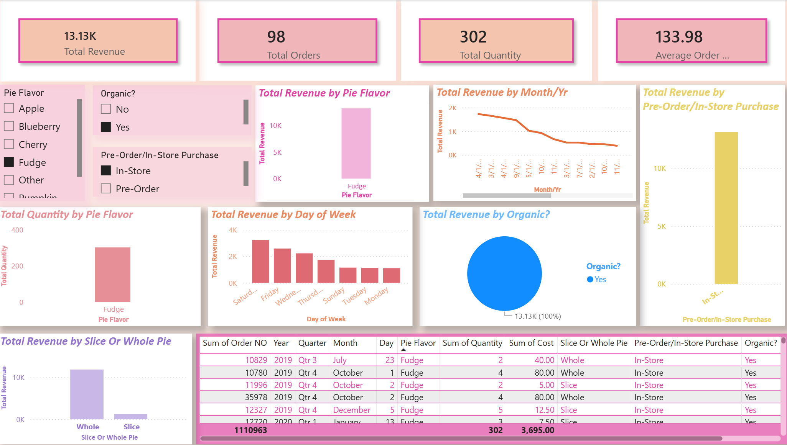

# Pie Bakery Sales Dashboard

## Project Overview

An interactive Power BI dashboard built to analyze Pie Bakery sales performance and identify trends across revenue, orders, quantity, pie flavors, purchase types, and organic products.

## Tools Used

- Power BI
- DAX
- Excel/CSV

## Dashboard Features

- Total Revenue
- Total Orders
- Total Quantity Sold
- Average Order Value
- Revenue by Pie Flavor
- Quantity by Pie Flavor
- Monthly Revenue Trend
- Revenue by Purchase Type
- Revenue by Slice vs Whole Pie
- Organic vs Non-Organic Revenue
- Revenue by Day of Week
- Interactive slicers for filtering the dashboard

## Dashboard Preview

## Project Files

- `Pie_Bakery_Sales_Dashboard.pbix` — Power BI dashboard
- `dashboard.png` — Dashboard preview
